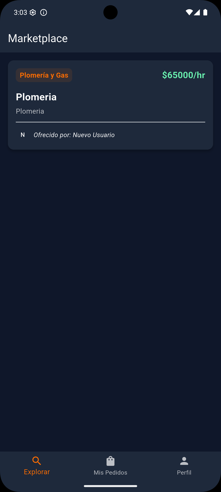
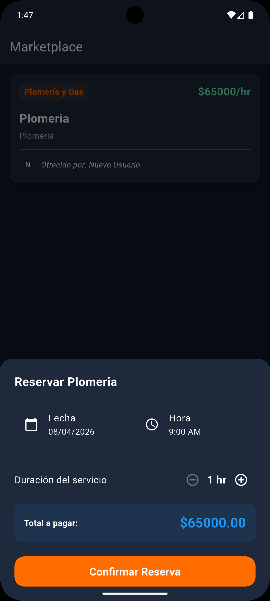
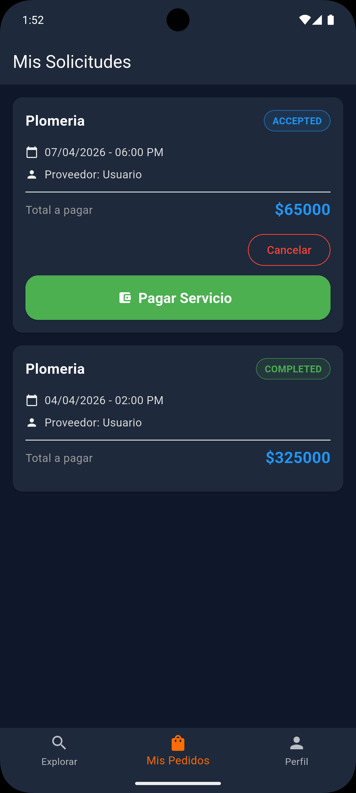
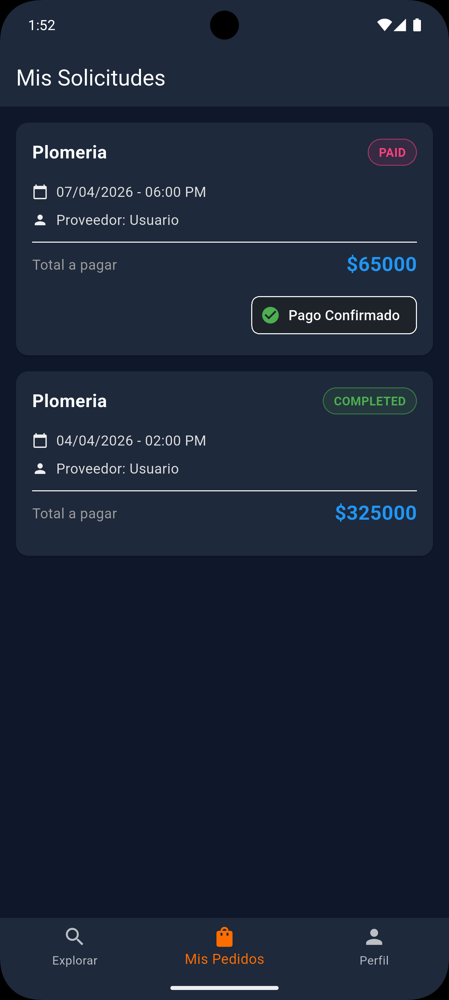
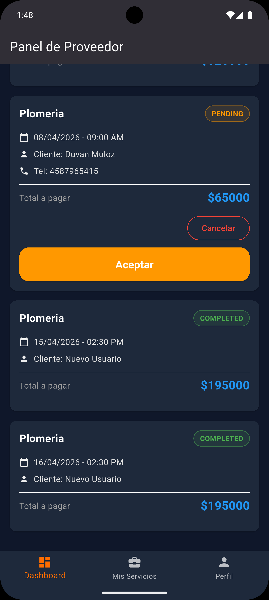
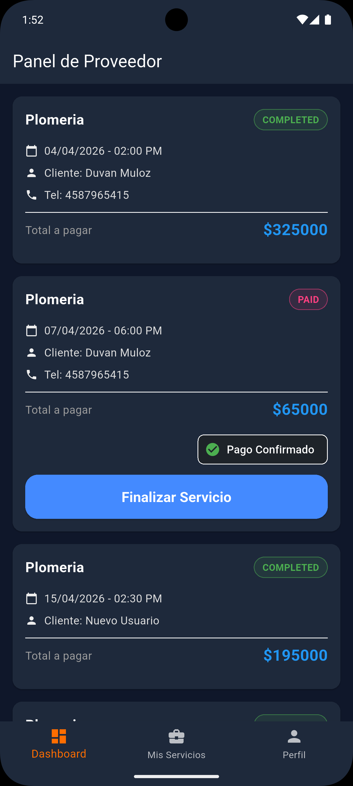
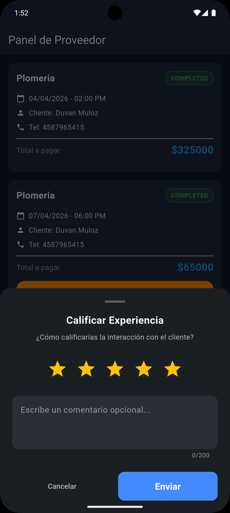

# 📱 Services Marketplace - Flutter App


[](https://flutter.dev/)
[](https://dart.dev/)

Esta es la aplicación móvil multiplataforma del ecosistema **Services Marketplace**. Diseñada con Flutter para ofrecer una experiencia de usuario nativa, fluida y moderna tanto en **Android** como en **iOS**.

---

---

## 🔄 Flujo Completo de Reserva (End-to-End)

Demostración detallada del proceso de contratación y gestión de un servicio, cubriendo la experiencia tanto del Cliente como del Proveedor.

### 🧑‍💻 Perspectiva del Cliente: Descubrimiento y Reserva

| 1. Búsqueda y Detalle | 2. Configurar Reserva | 3. Confirmación y Pago |
| :---: | :---: | :---: |
|  |  |  |
| El cliente explora las categorías y selecciona un servicio (ej. Plomería). | Se define la fecha, hora y duración del servicio. | Se pre-autoriza el pago y la solicitud se envía al proveedor. |

### 🛠️ Perspectiva del Proveedor: Gestión y Finalización

| 1. Recibir Solicitud | 2. Aceptar/Rechazar | 3. Finalizar y Calificar |
| :---: | :---: | :---: |
|  |  |  |
| El proveedor ve la nueva solicitud "PENDING" en su panel. Al aceptar, el estado cambia a "ACCEPTED".|   Una vez realizado el trabajo, el proveedor lo marca como "COMPLETED" | Finalmente se puede calificar al cliente. |

---

---

## 🛠️ Stack Tecnológico & Arquitectura

* **Framework:** [Flutter](https://flutter.dev/) (Multi-platform stable channel).
* **Lenguaje:** [Dart](https://dart.dev/).
* **Gestión de Estado:** Riverpod / BLoC / Provider (el que estés usando).
* **Navegación:** GoRouter / AutoRoute.
* **Backend Integration:** REST API (conectado a la API de NestJS) con Dio.
* **Base de Datos Local:** Hive / SQLite (Sembast, Moor, etc.).

La aplicación sigue principios de **Clean Architecture** para separar la lógica de negocio de la interfaz de usuario, facilitando la escalabilidad y las pruebas.

---

## ⚙️ CI/CD (Automatización Pro)

Este repositorio cuenta con un pipeline avanzado de **GitHub Actions** que valida cada commit en entornos nativos:

1.  **Dart Linting:** Verificación estricta de reglas de código Dart.
2.  **Build Multi-Plataforma:**
    * 🤖 Generación de **Android App Bundle (AAB)** en entorno Linux.
    * 🍏 Validación de compilación para **iOS (No-codesign)** en entorno macOS nativo.
3.  **Mocking Seguro:** El pipeline inyecta configuraciones "dummy" de Firebase y `.env` para garantizar builds exitosos sin comprometer llaves reales de producción.

---

## 🚀 Instalación y Uso (Desarrollo)

**1\.Clonar el repositorio:**
   ```bash
   git clone [https://github.com/tu-usuario/repo-flutter.git](https://github.com/tu-usuario/repo-flutter.git)
```
**2\. Instalar dependencias:**  

```
flutter pub get
```

**3\. Configurar Firebase & Environment:** Copia `.env.example` a `.env` y asegúrate de tener los archivos `google-services.json` (Android) y `GoogleService-Info.plist` (iOS) generados en sus respectivas carpetas nativas.

**4\. Ejecutar la app:**  


```
flutter run
```

